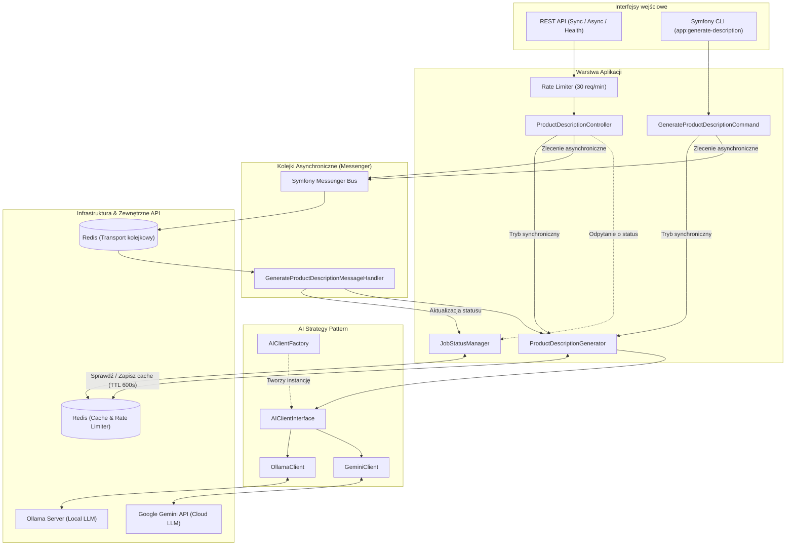

# 🛒 Product Description Microservice

🌐 **Język / Language:** [🇺🇸 English](README.md) | **[🇵🇱 Polski](README.pl.md)**

[](https://github.com/michal-kraus/ai-product-description-microservice/actions/workflows/ci.yml)
[](https://www.php.net/)
[](https://symfony.com/)
[](https://phpstan.org/)
[](https://github.com/michal-kraus/ai-product-description-microservice)
[](openapi.yaml)
[](LICENSE)

Mikroserwis generujący profesjonalne opisy produktów e-commerce z wykorzystaniem AI (**Ollama** / **Google Gemini**).

Zaprojektowany jako wysoce skalowalny, niezależny serwis w architekturze mikroserwisowej — przyjmuje nazwę i cechy produktu, a zwraca gotowy opis marketingowy wygenerowany przez model językowy, z obsługą cache'owania, rate-limiterem i kolejkami asynchronicznymi.

> [!NOTE]
> **Projekt referencyjny / Portfolio Showcase**
> To repozytorium stanowi demonstracyjny mikroserwis klasy produkcyjnej, prezentujący najlepsze praktyki w **PHP 8.5** i **Symfony 8.1**, czystą architekturę (wzorce Strategy, Factory, Builder, DTO), asynchroniczne kolejki wiadomości, rate limiting, rygorystyczną analizę statyczną (PHPStan Level 8) oraz wysokie pokrycie testami (>99%).

---

## 🏛️ Architektura



### Kluczowe wzorce i mechanizmy

- **Strategy Pattern** — `AIClientInterface` z wymiennymi implementacjami (`OllamaClient`, `GeminiClient`)
- **Factory Pattern** — `AIClientFactory` tworzy klienta na podstawie zmiennej środowiskowej `AI_PROVIDER`
- **DTO (Data Transfer Objects)** — `DescriptionRequest`, `AIResponse` jako niemutowalne (readonly) Value Objects
- **Builder Pattern** — `PromptBuilder` z dynamicznie konfigurowalnym szablonem promptu
- **Sliding Window Rate Limiter** — ochrona API (30 req/min) z dedykowaną pulą cache
- **Async Message Processing** — asynchroniczne przetwarzanie zadań przez Symfony Messenger (Redis transport)
- **Multi-layer Cache** — Redis caching wygenerowanych opisów produktów (TTL: 600s)

---

## 📖 Dokumentacja API

> 🌐 **Interaktywny Swagger UI**: dostępny pod adresem **`http://localhost:8000/api/docs`**  
> 📄 **Plik specyfikacji**: [`openapi.yaml`](openapi.yaml) (OpenAPI 3.1)

### Endpointy

| Metoda | Ścieżka | Opis |
|---|---|---|
| `GET` | `/health` | Health check serwisu i zależności (Redis, AI provider) |
| `POST` | `/product/descriptions/sync` | Synchroniczne wygenerowanie opisu produktu |
| `POST` | `/product/descriptions/async` | Zlecenie asynchronicznego generowania (zwraca `job_id`) |
| `GET` | `/product/descriptions/async/{jobId}` | Odpytanie o status zadania asynchronicznego |
| `GET` | `/api/docs` | Interaktywna dokumentacja Swagger UI |

---

### Przykłady zapytań (cURL)

#### 1. Synchroniczne generowanie opisu
```bash
curl -X POST http://localhost:8000/product/descriptions/sync \
  -H "Content-Type: application/json" \
  -d '{"name": "Laptop Pro 16", "features": "16GB RAM, SSD 1TB, ekran 16 cali IPS"}'
```
```json
{
  "description": "Laptop Pro 16 to wydajny komputer przenośny z 16GB RAM..."
}
```

#### 2. Asynchroniczne zlecenie zadania
```bash
curl -X POST http://localhost:8000/product/descriptions/async \
  -H "Content-Type: application/json" \
  -d '{"name": "Smartfon Galaxy X", "features": "Ekran 6.7 AMOLED, 256GB, aparat 108MP"}'
```
```json
{
  "job_id": "669f1a2b3c4d5",
  "status": "pending"
}
```

#### 3. Sprawdzenie statusu zadania
```bash
curl http://localhost:8000/product/descriptions/async/669f1a2b3c4d5
```
```json
{
  "job_id": "669f1a2b3c4d5",
  "status": "completed",
  "description": "Smartfon Galaxy X to flagowy model...",
  "error": null
}
```

#### 4. Health Check
```bash
curl http://localhost:8000/health
```
```json
{
  "status": "healthy",
  "checks": {
    "redis": { "healthy": true, "details": "connected" },
    "ai_provider": { "healthy": true, "details": "provider: ollama" }
  }
}
```

---

## 💻 Konsola CLI

Poza REST API mikroserwis oferuje komendę Symfony CLI do generowania opisów:

```bash
# Synchroniczne wygenerowanie opisu w terminalu
php bin/console app:generate-description "Klawiatura Mechaniczna" "Przełączniki Red, podświetlenie RGB"

# Asynchroniczne wysłanie zadania do kolejki Messenger
php bin/console app:generate-description "Klawiatura Mechaniczna" "Przełączniki Red, RGB" --async
```

---

## 🛠️ Makefile (Developer Experience)

Dla wygody programisty przygotowano zestaw skrótów `make`:

```bash
make help        # Wyświetla listę wszystkich dostępnych poleceń
make check       # Uruchamia pełny zestaw weryfikacyjny (lint + stan + testy z coverage)
make test        # Uruchamia testy PHPUnit
make coverage    # Uruchamia testy z tabelą pokrycia kodu (PCOV)
make stan        # Uruchamia analizę statyczną PHPStan (Level 8)
make lint        # Waliduje pliki YAML i kontener Dependency Injection
make up          # Uruchamia kontenery Docker (Redis, Ollama, App, Worker)
make down        # Zatrzymuje kontenery Docker
make worker      # Uruchamia konsumenta wiadomości Messenger (async)
```

---

## 🚀 Szybki start (Uruchomienie lokalne)

### 1. Wymagania
- PHP 8.5+
- Composer 2
- Docker & Docker Compose
- Rozszerzenie PHP PCOV (opcjonalnie, do raportu code coverage)

### 2. Uruchomienie infrastruktury
```bash
make up
# lub: docker compose up -d
```

### 3. Pobranie lokalnego modelu AI (Ollama)
```bash
docker compose exec ai_local ollama pull qwen2.5:0.5b
```

### 4. Instalacja zależności i konfiguracja
```bash
composer install
cp .env .env.local
```

### 5. Uruchomienie serwera aplikacji
```bash
symfony serve
# lub
php -S localhost:8000 -t public/
```

### 6. Uruchomienie workera (kolejki async)
```bash
make worker
# lub: php bin/console messenger:consume async -vv
```

---

## 🧪 Testy i jakość kodu

Projekt posiada **62 testy automatyczne** (Unit + Functional) z **99.6% pokryciem kodu**:

```bash
make check
```

Wynik:
* **PHPStan Level 8**: `[OK] No errors` (37 plików)
* **PHPUnit 13**: `OK (62 tests, 200 assertions)`
* **Code Coverage**: `99.63% lines covered`

---

## ⚙️ Stos technologiczny

- **PHP 8.5** — `declare(strict_types=1)`, `readonly` classes, enums, match expressions, constructor promotion
- **Symfony 8.1** — Framework, Messenger, RateLimiter, Cache, HttpClient, Console, Serializer
- **Redis** — cache opisów produktów, rate limiter storage, transport kolejkowy Messenger
- **Ollama** — lokalny serwer AI (self-hosted LLM)
- **Google Gemini API** — chmurowy dostawca modeli LLM
- **PHPStan (Level 8)** — maksymalny poziom statycznej analizy typów
- **PHPUnit 13 & PCOV** — zestaw testów jednostkowych i funkcjonalnych z pomiarem pokrycia
- **Docker & Docker Compose** — konteneryzacja środowiska (multi-stage Alpine PHP-FPM)
- **OpenAPI 3.1 & Swagger UI** — standard dokumentacji API

---

## 📁 Struktura projektu

```
src/
├── AI/
│   ├── Client/
│   │   ├── AIClientInterface.php         # Kontrakt dla providerów AI
│   │   ├── GeminiClient.php              # Klient Google Gemini API
│   │   └── OllamaClient.php              # Klient lokalnego Ollama
│   ├── DTO/
│   │   ├── AIResponse.php                # Niemutowalna odpowiedź AI
│   │   └── DescriptionRequest.php        # Niemutowalne żądanie do AI
│   ├── Factory/
│   │   └── AIClientFactory.php           # Fabryka instancjonująca providera
│   └── Prompt/
│       └── PromptBuilder.php             # Budowniczy promptów z szablonów
├── Command/
│   └── GenerateProductDescriptionCommand.php # Konsolowa komenda CLI
├── Controller/
│   ├── ApiDocsController.php             # Swagger UI oraz specyfikacja OpenAPI
│   ├── HealthCheckController.php         # Endpoint monitoringu /health
│   └── ProductDescriptionController.php  # REST API endpointy (sync & async)
├── Enum/
│   └── GenerateProductDescriptionMessageStatus.php # Maszyna stanów zadania
├── Exception/
│   └── ProductDescriptionGenerationException.php   # Dedykowany wyjątek domenowy
├── Message/
│   └── GenerateProductDescriptionMessage.php       # DTO wiadomości asynchronicznej
├── MessageHandler/
│   └── GenerateProductDescriptionMessageHandler.php # Konsument wiadomości kolejki
└── Service/
    ├── JobStatusManager.php              # Zarządzanie stanem zadań w Redis
    └── ProductDescriptionGenerator.php    # Główna orkiestracja generowania z cache
```
